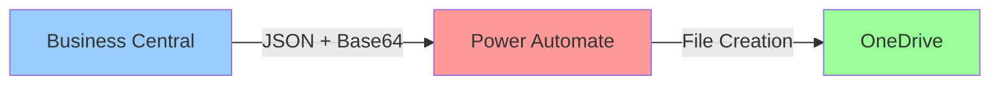
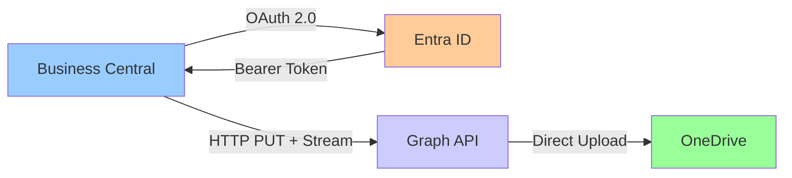

# Business Central → OneDrive Integration

> **Proyecto Formativo**: Integración directa de Business Central con OneDrive usando Microsoft Graph API

## 📋 Índice

- [Resumen Ejecutivo](#resumen-ejecutivo)
- [Arquitectura Técnica](#arquitectura-técnica)
- [Configuración y Setup](#configuración-y-setup)
- [Patrones de Desarrollo AL](#patrones-de-desarrollo-al)
- [Casos de Uso](#casos-de-uso)
- [Troubleshooting](#troubleshooting)
- [Evolución del Proyecto](#evolución-del-proyecto)

---

## 🎯 Resumen Ejecutivo

Este proyecto demuestra cómo integrar **Business Central** con **OneDrive** de forma directa usando **Microsoft Graph API**, eliminando dependencias de Power Automate y proporcionando control total sobre el proceso de exportación.

### ¿Qué hace?

- **Genera archivos TXT** con datos de BC (estructura personalizable)
- **Sube automáticamente** a OneDrive con estructura de carpetas organizadas: `BC/{Company}/{YYYY}/{MM}/`
- **Autenticación OAuth 2.0** Client Credentials flow
- **Reintentos automáticos** con backoff exponencial
- **Interfaz de administración** para configuración y testing

### ¿Por qué es útil para aprender AL?

- **Patrones HTTP**: HttpClient, headers, content management
- **OAuth 2.0**: Integración con servicios externos seguros
- **Streams**: Manejo de InStream/OutStream para archivos
- **Error Handling**: Estrategias robustas de manejo de errores
- **Setup Pages**: Configuración de extensiones con secretos
- **JSON**: Serialización y parsing de respuestas API

---

## 🏗️ Arquitectura Técnica

### Componentes Principales

```
┌─────────────────────────────────────────────────────────────┐
│                    Business Central                         │
├─────────────────────────────────────────────────────────────┤
│  Codeunit 50510: TXT → Webhook Orchestrator                │
│  ├── ExportFakeTxtToOneDrive()                             │
│  ├── ExportTxtContentToOneDrive()                          │
│  └── OAuth + HTTP Management                                │
├─────────────────────────────────────────────────────────────┤
│  Table 50511: OneDrive Webhook Setup                       │
│  └── OAuth credentials + OneDrive user config              │
├─────────────────────────────────────────────────────────────┤
│  Page 50512: OneDrive Webhook Setup                        │
│  └── Admin interface + Test actions                        │
└─────────────────────────────────────────────────────────────┘
                              │
                              │ HTTPS PUT
                              │ Bearer Token
                              ▼
┌─────────────────────────────────────────────────────────────┐
│                Microsoft Graph API                          │
│  https://graph.microsoft.com/v1.0/users/{user}/drive/      │
│                   root:/{path}:/content                     │
└─────────────────────────────────────────────────────────────┘
                              │
                              ▼
┌─────────────────────────────────────────────────────────────┐
│                      OneDrive                               │
│  BC/CRONUS International Ltd./2025/09/Export_xxx.txt       │
└─────────────────────────────────────────────────────────────┘
```

### Flujo de Datos

1. **Generación**: `CreateFakeTxtInStream()` → TempBlob → InStream
2. **Autenticación**: `AddOAuthAuthorizationHeader()` → OAuth2 → Bearer token
3. **Upload**: `TryPost()` → HTTP PUT → Graph API → OneDrive
4. **Retry Logic**: `PostWithRetry()` → Exponential backoff en fallos

---

## ⚙️ Configuración y Setup

### 1. Registro en Entra ID (Azure Active Directory)

#### Crear App Registration

```bash
# Azure Portal > Entra ID > App registrations > New registration
Name: "BusinessCentral OneDrive Integration"
Account types: "Single tenant"
Redirect URI: (leave empty)
```

#### Configurar Permisos

```bash
# API permissions > Add a permission > Microsoft Graph > Application permissions
Files.ReadWrite.All ✓

# ⚠️ CRÍTICO: Grant admin consent for [tenant]
```

#### Obtener Credenciales

```bash
# Overview tab
Application (client) ID: xxxxxxxx-xxxx-xxxx-xxxx-xxxxxxxxxxxx
Directory (tenant) ID: xxxxxxxx-xxxx-xxxx-xxxx-xxxxxxxxxxxx

# Certificates & secrets > New client secret
Client Secret: xxxxxxxxxxxxxxxxxxxxxxxxxxxxxxxxxxxxx
```

### 2. Configuración en Business Central

#### Abrir Setup Page

```al
// Buscar: "OneDrive Webhook Setup"
// Ubicación: Administration → Extensions → OneDrive Webhook Setup
```

#### Completar Campos

```al
Tenant ID:           "tu-tenant-id"
Client ID:           "tu-client-id"  
Client Secret:       "tu-client-secret"
OneDrive User Email: "usuario@tudominio.com"
```

### 3. Testing y Validación

#### Test Básico

```al
// En la página setup, ejecutar:
Action: "Test Graph API Upload"
// Debería mostrar: "OK (201). Archivo subido: TestGraph_xxx.txt"
```

#### Verificación Manual

```powershell
# PowerShell: Validar token OAuth fuera de BC
$tenant = 'tu-tenant-id'
$clientId = 'tu-client-id'  
$clientSecret = 'tu-client-secret'
$body = @{
  client_id = $clientId
  scope = 'https://graph.microsoft.com/.default'
  client_secret = $clientSecret
  grant_type = 'client_credentials'
}
$response = Invoke-RestMethod -Method Post -Uri "https://login.microsoftonline.com/$tenant/oauth2/v2.0/token" -Body $body
$response.access_token
```

---

## 🧩 Patrones de Desarrollo AL

### 1. HTTP Client Patterns

```al
local procedure TryPost(var InStream: InStream; ...): Boolean
var
    Http: HttpClient;
    HttpResp: HttpResponseMessage;
    Content: HttpContent;
    ReqHeaders: HttpHeaders;
begin
    // ✅ Patrón: Inicializar headers antes de OAuth
    ReqHeaders := Http.DefaultRequestHeaders();
    
    // ✅ Patrón: Validación temprana y error handling
    if not AddOAuthAuthorizationHeader(Http, ResponseText) then begin
        LastResponseText := ResponseText;
        exit(false);
    end;
    
    // ✅ Patrón: Content directo para Graph API (no JSON wrapper)
    Content.WriteFrom(InStrCopy);
    
    // ✅ Patrón: Content-Type en content headers, no request headers
    Content.GetHeaders(Headers);
    Headers.Add('Content-Type', ContentType);
    
    // ✅ Patrón: PUT para Graph API uploads
    exit(Http.Put(Url, Content, HttpResp));
end;
```

### 2. OAuth 2.0 Implementation

```al
local procedure AddOAuthAuthorizationHeader(var Http: HttpClient; var ErrorText: Text): Boolean
var
    OAuth2: Codeunit OAuth2;
    AccessToken: SecretText;
    ClientSecret: SecretText;
begin
    // ✅ Patrón: SecretText para credenciales sensibles
    ClientSecret := SecretText.SecretStrSubstNo('%1', Setup."Client Secret");
    
    // ✅ Patrón: Client Credentials flow para app-to-app
    if OAuth2.AcquireTokenWithClientCredentials(ClientID, ClientSecret, AuthorityUrl, '', Scope, AccessToken) then begin
        // ✅ Patrón: SecretStrSubstNo para construir headers con SecretText
        if not Http.DefaultRequestHeaders().Add('Authorization', SecretStrSubstNo('Bearer %1', AccessToken)) then begin
            ErrorText := 'Error: No se pudo agregar header Authorization';
            exit(false);
        end;
        exit(true);
    end;
end;
```

### 3. Stream Management

```al
local procedure CreateTxtFromText(Content: Text; FileBaseName: Text; var OutInStream: InStream; var FileName: Text)
var
    TempBlob: Codeunit "Temp Blob";
    OutStr: OutStream;
begin
    // ✅ Patrón: TempBlob para datos temporales en memoria
    TempBlob.CreateOutStream(OutStr);
    OutStr.WriteText(Content);
    
    // ✅ Patrón: InStream para consumo posterior
    TempBlob.CreateInStream(OutInStream);
    
    // ✅ Patrón: Nombres de archivo sanitizados
    FileName := StrSubstNo('%1_%2.txt', 
        SanitizeForFileName(FileBaseName), 
        SanitizeForFileName(Format(CurrentDateTime(), 0, 9)));
end;
```

### 4. Retry Logic con Exponential Backoff

```al
local procedure PostWithRetry(InStream: InStream; ...; Retries: Integer): Boolean
var
    Attempt: Integer;
    DelayMs: Integer;
begin
    for Attempt := 1 to Retries do begin
        if TryPost(InStream, FileName, FolderPath, ContentType, ResponseText) then
            exit(true);
            
        // ✅ Patrón: Exponential backoff para reintentos
        DelayMs := Power(2, Attempt) * 500; // 500ms, 1s, 2s...
        Sleep(DelayMs);
        
        // ✅ Patrón: Reset stream para reutilización
        ResetInStream(InStream);
    end;
    exit(false);
end;
```

### 5. Error Handling y User Feedback

```al
procedure GetLastResultMessage(): Text
var
    JObj: JsonObject;
    ErrorMsg: Text;
begin
    // ✅ Patrón: Diferentes respuestas según HTTP status
    if (LastStatusCode >= 200) and (LastStatusCode < 300) then begin
        // Éxito: Extraer info útil de Graph API response
        if JObj.ReadFrom(LastResponseText) then begin
            if JObj.Get('name', Tok) then
                FileName := Tok.AsValue().AsText();
            exit(StrSubstNo('OK (%1). Archivo subido: %2', Format(LastStatusCode), FileName));
        end;
    end else begin
        // Error: Extraer mensaje específico de Graph API
        if JObj.Get('error', Tok) then begin
            ErrorMsg := ExtractGraphAPIError(Tok.AsObject());
            exit(StrSubstNo('Error (%1). %2', Format(LastStatusCode), ErrorMsg));
        end;
    end;
end;
```

---

## 🎮 Casos de Uso

### 1. Export desde Setup con Contenido Personalizado

```al
// En la página OneDrive Webhook Setup:
// 1. Rellenar campo "TXT Content" con tu texto
// 2. Pulsar acción "Subir TXT con contenido de Setup"
// → Se crea archivo "SetupTXT_YYYY-MM-DD_HH-MM-SS.txt" en OneDrive

// Programáticamente:
procedure ExportCustomContent()
var
    Orchestrator: Codeunit "TXT → Webhook Orchestrator";
begin
    Orchestrator.ExportTxtFromSetupField();
    Message(Orchestrator.GetLastResultMessage());
end;
```

### 2. Export Automático desde Job Queue

```al
// En tu codeunit de proceso:
procedure ExportDailyReports()
var
    Orchestrator: Codeunit "TXT → Webhook Orchestrator";
    Customer: Record Customer;
    Content: Text;
begin
    // Generar contenido dinámico
    Content := BuildCustomerReport(Customer);
    
    // Subir a OneDrive
    Orchestrator.ExportTxtContentToOneDrive('DailyCustomers', Content);
    
    // Log resultado
    LogResult(Orchestrator.GetLastResultMessage());
end;
```

### 3. Export Manual desde Página

```al
// En una action de página:
trigger OnAction()
var
    Orchestrator: Codeunit "TXT → Webhook Orchestrator";
begin
    Orchestrator.ExportFakeTxtToOneDrive();
    Message(Orchestrator.GetLastResultMessage());
end;
```

### 4. Estructura de Archivos en OneDrive

```
OneDrive/
└── BC/                          (o ruta personalizada)
    └── CRONUS International Ltd/
        └── 2025/
            └── 09/
                ├── SetupTXT_2025-09-12_15-30-45.txt
                ├── Export_CRONUS_2025-09-12_16-15-22.txt
                └── TestGraph_2025-09-12_14-45-33.txt
```

**Configuración de Ruta:**
- **Por defecto**: `BC/{Company}/{YYYY}/{MM}/`
- **Personalizada**: Rellenar `OneDrive Folder Path` en Setup (ej: `MisExports/BC`)

### 5. Contenido de Archivos TXT

**Desde Setup (`ExportTxtFromSetupField`):**
```
[Contenido del campo "TXT Content"]
```

**Fake Data (`ExportFakeTxtToOneDrive`):**
```
HEADER|BC|CRONUS International Ltd.|2025-09-12
LINE|0001|Articulo X|10|9.95
LINE|0002|Articulo Y|5|19.50
FOOTER|COUNT|2
```

**Personalizado (`ExportTxtContentToOneDrive`):**
```
[Tu contenido pasado como parámetro]
```

---

## 🔧 Troubleshooting

### Errores Comunes

#### 1. "Authorization_RequestDenied" / "Insufficient privileges"

```json
{"error":{"code":"Authorization_RequestDenied","message":"Insufficient privileges to complete the operation."}}
```

**Causa**: La aplicación no tiene los permisos correctos o falta admin consent  
**Solución**:

1. **Ve a Azure Portal** → Entra ID → App registrations → [Tu App]
2. **API permissions** → Add a permission → Microsoft Graph
3. **Application permissions** (no delegated):
   - ✅ `Files.ReadWrite.All` - Para subir archivos a OneDrive
   - ✅ `User.Read.All` - Para resolver usuarios
4. **Grant admin consent** for [tenant] (botón azul importante)
5. **Espera 5-10 minutos** para que se propague

**Verificación**:
```powershell
# Ejecuta el script verify-permissions.ps1 incluido
.\verify-permissions.ps1
```

#### 2. "Invalid client"

```json
{"error":"invalid_client","error_description":"AADSTS7000215: Invalid client secret"}
```

**Causa**: Client secret expirado o incorrecto  
**Solución**:
- Ve a App Registration → Certificates & secrets
- Genera un nuevo client secret
- Actualiza en Business Central → OneDrive Webhook Setup

#### 3. "User not found"

```json
{"error":{"code":"Request_ResourceNotFound","message":"The user object was not found."}}
```

**Causa**: Email en `OneDrive User Email` no existe o no tiene OneDrive  
**Solución**:
- Verifica que el email sea correcto
- Confirma que el usuario tiene OneDrive activado
- Prueba con un usuario diferente

### Debugging Steps

#### 1. Validar Token OAuth

```powershell
# Test manual token acquisition
$response = Invoke-RestMethod -Method Post -Uri "https://login.microsoftonline.com/$tenant/oauth2/v2.0/token" -Body $body
if ($response.access_token) { 
    Write-Host "✅ Token obtenido correctamente" 
} else { 
    Write-Host "❌ Error OAuth: $($response.error_description)" 
}
```

#### 2. Test Graph API Direct

```powershell
# Test directo a Graph API
$headers = @{ Authorization = "Bearer $($response.access_token)" }
$testContent = "Hello from PowerShell test"
$user = "usuario@tudominio.com"
$path = "BC/Test/test.txt"
$uri = "https://graph.microsoft.com/v1.0/users/$user/drive/root:/$path:/content"

try {
    $result = Invoke-RestMethod -Method Put -Uri $uri -Headers $headers -Body $testContent -ContentType 'text/plain'
    Write-Host "✅ Upload exitoso: $($result.name)"
} catch {
    Write-Host "❌ Error Graph API: $($_.Exception.Message)"
}
```

#### 3. Verificar Permisos Graph API

```powershell
# Verificar permisos efectivos del token
$headers = @{ Authorization = "Bearer $($response.access_token)" }
$appInfo = Invoke-RestMethod -Method Get -Uri "https://graph.microsoft.com/v1.0/me" -Headers $headers
$appInfo
```

---

## 📈 Evolución del Proyecto

### Versión Inicial: Power Automate Webhook



**Problemas encontrados:**

- Power Automate requería OAuth para Direct API URLs
- Complejidad de configuración externa
- Dependencia de servicio intermedio
- Manejo de errores limitado

### Versión Final: Graph API Directa



**Beneficios conseguidos:**

- Control total del proceso
- Mejor manejo de errores
- Eliminación de dependencias externas
- Autenticación integrada en BC
- Flexibilidad para diferentes tipos de archivo

### Lecciones Aprendidas

#### 1. **HttpClient Headers Management**

- `Content-Type` va en `Content.GetHeaders()`, no en `Http.DefaultRequestHeaders()`
- `Authorization` debe agregarse a `Http.DefaultRequestHeaders()` antes del request
- Los headers persisten en la instancia `HttpClient`

#### 2. **OAuth 2.0 en Extensions**

- `SecretText` no se puede convertir a `Text` directamente en extensions
- Usar `SecretStrSubstNo()` para construir headers seguros
- `OAuth2.AcquireTokenWithClientCredentials()` versión con `SecretText` es la actual

#### 3. **Stream Handling**

- `TempBlob` es ideal para datos temporales en memoria
- Streams se consumen en una sola pasada → `ResetInStream()` para reutilizar
- `Content.WriteFrom(InStream)` es la forma correcta para HTTP content

#### 4. **Error Handling**

- Capturar errores en múltiples niveles: OAuth, HTTP, Graph API
- Graph API devuelve estructura `{"error": {"code": "...", "message": "..."}}`
- Feedback claro al usuario mejora la experiencia de debugging

---

## 🚀 Próximos Pasos / Extensiones

### 1. Soporte Multi-formato

```al
// Extender para PDF, Excel, etc.
procedure ExportStreamToOneDrive(InStr: InStream; FileName: Text; ContentType: Text)
```

### 2. Metadata Enhancement

```al
// Agregar metadata personalizada a archivos
procedure SetFileMetadata(FileId: Text; Metadata: JsonObject)
```

### 3. Batch Operations

```al
// Upload múltiple en una operación
procedure ExportMultipleFilesToOneDrive(Files: List of [FileInfo])
```

### 4. SharePoint Integration

```al
// Extender a SharePoint document libraries
procedure ExportToSharePointLibrary(SiteId: Text; LibraryName: Text; ...)
```

---

## 📚 Referencias

### Microsoft Graph API

- [Files API Reference](https://docs.microsoft.com/en-us/graph/api/resources/driveitem)
- [Upload large files](https://docs.microsoft.com/en-us/graph/api/driveitem-createuploadsession)

### Business Central AL

- [HttpClient Class](https://docs.microsoft.com/en-us/dynamics365/business-central/dev-itpro/developer/methods-auto/httpclient/httpclient-data-type)
- [OAuth2 Class](https://docs.microsoft.com/en-us/dynamics365/business-central/dev-itpro/developer/methods-auto/oauth2/oauth2-data-type)

### Azure Entra ID

- [App Registration Guide](https://docs.microsoft.com/en-us/azure/active-directory/develop/quickstart-register-app)
- [Client Credentials Flow](https://docs.microsoft.com/en-us/azure/active-directory/develop/v2-oauth2-client-creds-grant-flow)

---

## 👨‍💻 Autor

**Proyecto Formativo**: Integración BC → OneDrive con Microsoft Graph API  
**Objetivo**: Demostrar patrones avanzados de AL development para integraciones externas

---

*¿Preguntas o mejoras? Abre un issue o contribuye al proyecto!*
